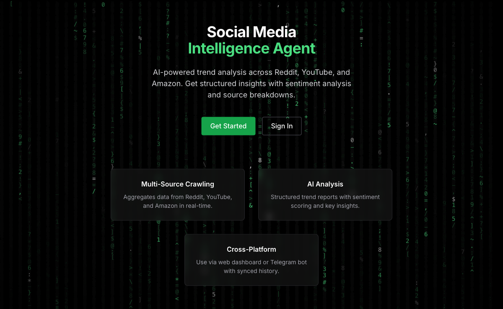
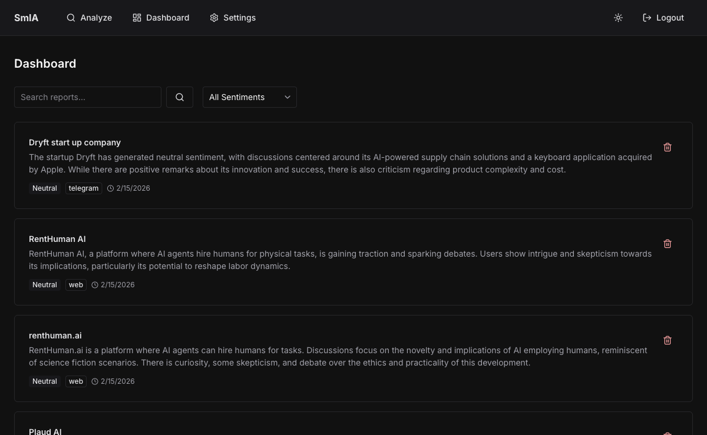
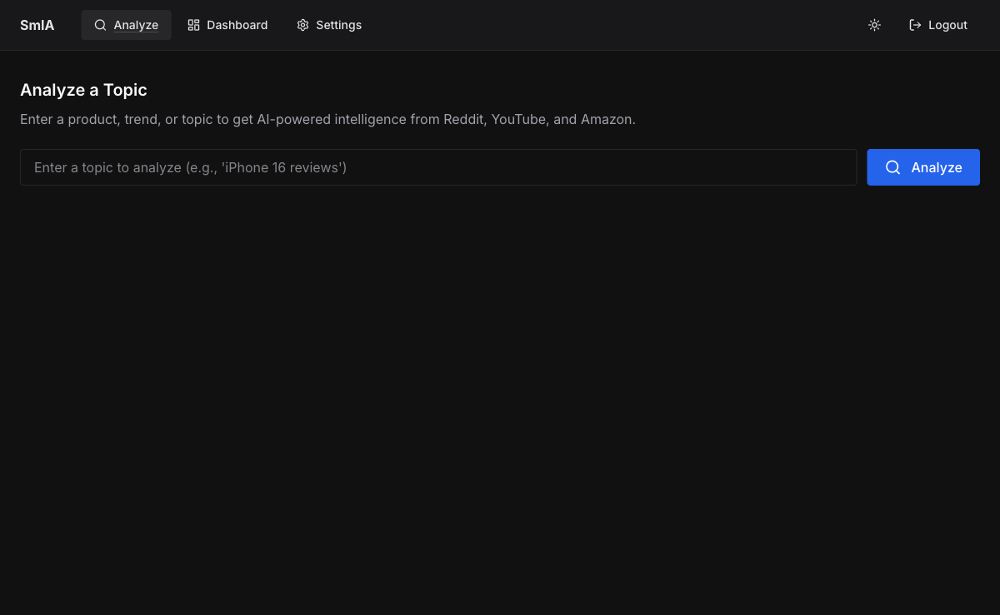
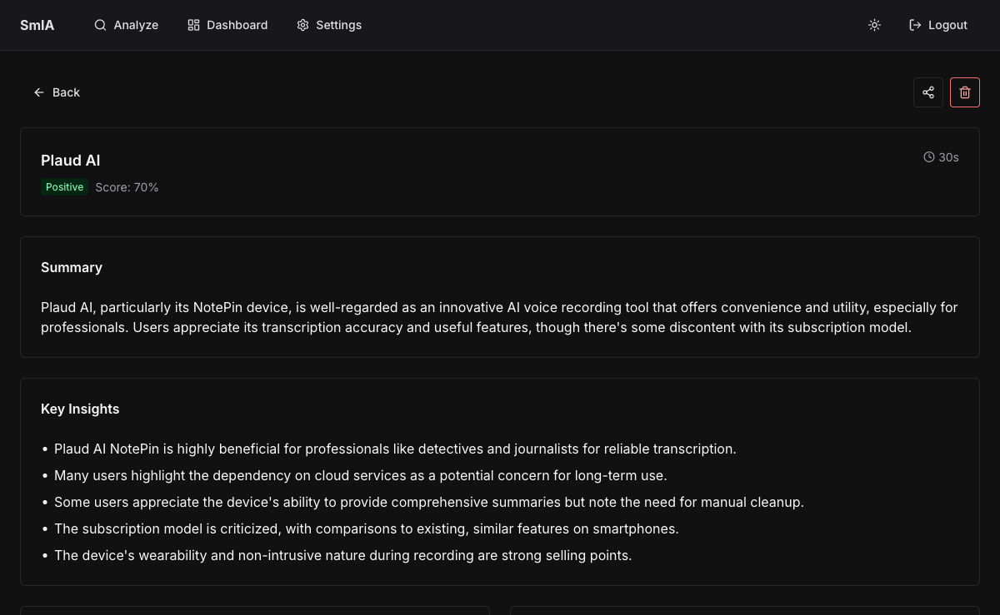
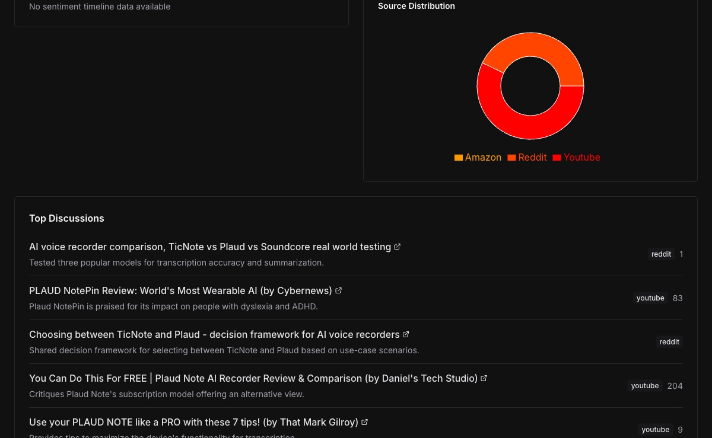

# SmIA - Social Media Intelligence Agent

> **Live site: [smia-agent.vercel.app](https://smia-agent.vercel.app)**



SmIA is a dual-interface AI intelligence platform that aggregates and analyzes content from multiple social media sources — Reddit, YouTube, and Amazon — in response to natural language queries. It delivers structured trend reports with sentiment analysis, key insights, and interactive data visualizations.

Unlike traditional scrapers that merely extract raw data, SmIA **understands** content through AI-powered analysis, filtering out noise and surfacing what actually matters.

---

## What It Does

Ask a question like *"What's the sentiment on Plaud Note?"* and SmIA will:

1. **Crawl** Reddit posts, YouTube comments, and Amazon reviews in parallel
2. **Clean** the data — stripping ads, spam, and off-topic noise
3. **Analyze** everything with GPT-4o, producing a structured intelligence report
4. **Visualize** the results with interactive charts, sentiment scores, and source breakdowns

Every analysis is saved to your personal dashboard and can be accessed from both the web app and a Telegram bot.

---

## Interfaces

### Web Application

The primary experience — a full-featured React web app with:

- **Natural language query input** — just describe what you want to know
- **Real-time progress tracking** — watch as SmIA fetches, cleans, and analyzes data
- **Interactive results** — sentiment timeline charts, source distribution pie charts, keyword tags, and expandable discussion threads grouped by platform
- **Historical dashboard** — browse, search, and filter all past analyses with pagination
- **Dark/light theme** — system-aware with manual toggle










### Telegram Bot


A companion mobile experience for quick analysis on the go:

- `/analyze <topic>` — run a full analysis and get a text summary
- `/history` — view your recent analyses with links to full web reports
- `/bind <code>` — link your Telegram account to the web platform

Telegram analyses automatically sync to the web dashboard, so you can start an analysis from your phone and review the full charts on desktop later.

---

## Architecture

```
                    Users
           ┌─────────┴─────────┐
      Web Browser         Telegram App
           │                    │
           ▼                    ▼
    ┌──────────────────────────────────┐
    │      Vercel (Edge + Serverless)  │
    │  ┌────────────┐ ┌─────────────┐ │
    │  │React SPA   │ │FastAPI +    │ │
    │  │Chakra UI v3│ │Mangum       │ │
    │  │Recharts    │ │PydanticAI   │ │
    │  └────────────┘ └──────┬──────┘ │
    └────────────────────────┼────────┘
                             │
         ┌───────────────────┼───────────────────┐
         ▼                   ▼                   ▼
    ┌──────────┐     ┌─────────────┐     ┌────────────┐
    │Supabase  │     │OpenAI       │     │Langfuse    │
    │PostgreSQL│     │GPT-4o       │     │Observability│
    │+ Auth    │     │             │     │            │
    └──────────┘     └─────────────┘     └────────────┘
```

### Backend (Python)

- **FastAPI** running as Vercel serverless functions via Mangum
- **PydanticAI** agent with 4 tools: `fetch_reddit`, `fetch_youtube`, `fetch_amazon`, `clean_noise`
- **Structured outputs** — every analysis produces a validated `TrendReport` Pydantic model
- **YARS** for Reddit data (no API key required)
- **YouTube Data API v3** for video metadata and comments
- **Firecrawl** for Amazon review extraction
- **Supabase** for PostgreSQL database with Row Level Security
- **Langfuse** for full LLM observability — traces every tool call, token usage, and cost

### Frontend (TypeScript)

- **React 19** with **Vite** for fast builds
- **Chakra UI v3** component library with custom theme system
- **Recharts** for sentiment timeline and source distribution charts
- **Supabase Auth** with JWT — email/password and Google OAuth
- Lazy-loaded routes and chart components for optimized bundle size

### Cross-Platform Sync

Both interfaces share the same backend and database. A single `user_id` (from Supabase Auth) links web sessions and Telegram accounts through a binding code system. Reports created from either interface appear in the unified dashboard.

---

## Data Sources

| Source | Method | What's Collected |
|--------|--------|-----------------|
| **Reddit** | YARS library (no API key) | Posts, comments, upvotes, subreddit context |
| **YouTube** | YouTube Data API v3 | Video metadata, comment threads, like counts |
| **Amazon** | Firecrawl web scraping | Product reviews, ratings, review text |

Each source has a 45-second timeout. If one source fails, SmIA gracefully degrades and continues with the others.

---

## Analysis Report Structure

Every analysis produces a `TrendReport` containing:

| Field | Description |
|-------|-------------|
| **Topic** | The main subject analyzed |
| **Sentiment** | Positive / Negative / Neutral with a 0-1 score |
| **Summary** | 2-3 sentence executive overview |
| **Key Insights** | 3-5 bullet points highlighting the most important findings |
| **Top Discussions** | Notable posts/comments from each source with links |
| **Keywords** | 5-10 trending terms extracted from the data |
| **Source Breakdown** | Item count per platform |
| **Charts Data** | Sentiment timeline and source distribution for visualization |
| **Metadata** | Processing time, token usage, Langfuse trace ID |

---

## Observability

Every LLM interaction is traced through **Langfuse**:

- Full call chain visibility — from user query to final report
- Per-tool tracing (fetch, clean, analyze)
- Token usage and cost tracking per query
- User and session attribution
- Prompt performance analytics

---

## Tech Stack

| Layer | Technology |
|-------|-----------|
| Frontend | React 19, Vite, TypeScript |
| UI | Chakra UI v3, Recharts |
| Backend | FastAPI, Python 3.12+ |
| Agent Framework | PydanticAI |
| LLM | OpenAI GPT-4o |
| Database | PostgreSQL (Supabase) |
| Auth | Supabase Auth (JWT) |
| Web Scraping | YARS, Firecrawl, YouTube API |
| Observability | Langfuse |
| Deployment | Vercel (Edge + Serverless) |
| Package Managers | uv (Python), pnpm (Node.js) |

---

## Project Structure

```
smia-agent/
├── api/                          # FastAPI backend
│   ├── index.py                  # Entrypoint (Mangum handler)
│   ├── routes/
│   │   ├── analyze.py            # POST /api/analyze
│   │   ├── reports.py            # Reports CRUD
│   │   ├── auth.py               # Telegram binding
│   │   └── telegram.py           # Webhook endpoint
│   ├── services/
│   │   ├── agent.py              # PydanticAI agent config
│   │   ├── tools.py              # Agent tools (fetch, clean)
│   │   ├── crawler.py            # Multi-source crawling
│   │   ├── database.py           # Supabase operations
│   │   └── telegram_service.py   # Bot command handlers
│   ├── models/
│   │   └── schemas.py            # Pydantic models
│   ├── core/
│   │   ├── config.py             # Environment config
│   │   ├── auth.py               # JWT verification
│   │   └── langfuse_config.py    # Langfuse setup
│   └── tests/                    # 131 unit tests
│
├── frontend/                     # React application
│   └── src/
│       ├── pages/                # 7 pages (Home, Login, Signup,
│       │                         #   Analyze, Dashboard, ReportDetail,
│       │                         #   Settings)
│       ├── components/           # Reusable UI components
│       │   ├── charts/           # Recharts visualizations
│       │   ├── ReportViewer.tsx   # Full report display
│       │   ├── ReportCard.tsx     # Dashboard card
│       │   └── AnalysisForm.tsx   # Query input
│       ├── hooks/
│       │   └── useAuth.ts        # Authentication hook
│       └── lib/
│           ├── api.ts            # Typed API client
│           ├── supabase.ts       # Supabase client
│           └── theme.ts          # Chakra UI theme
│
├── shared/                       # Shared TypeScript types
├── libs/yars/                    # Reddit scraping library
├── scripts/                      # Utility scripts
└── vercel.json                   # Deployment config
```

---

## Security

- **Row Level Security** on all database tables — users can only access their own data
- **JWT authentication** on all API endpoints (except the Telegram webhook, which is validated via bot token)
- **Input validation** via Pydantic models
- **Rate limiting** — 100 requests/hour (web), 10 analyses/hour (Telegram)
- **No raw HTML stored** — only processed analysis results

---

## License

This project is not open for redistribution. All rights reserved.
